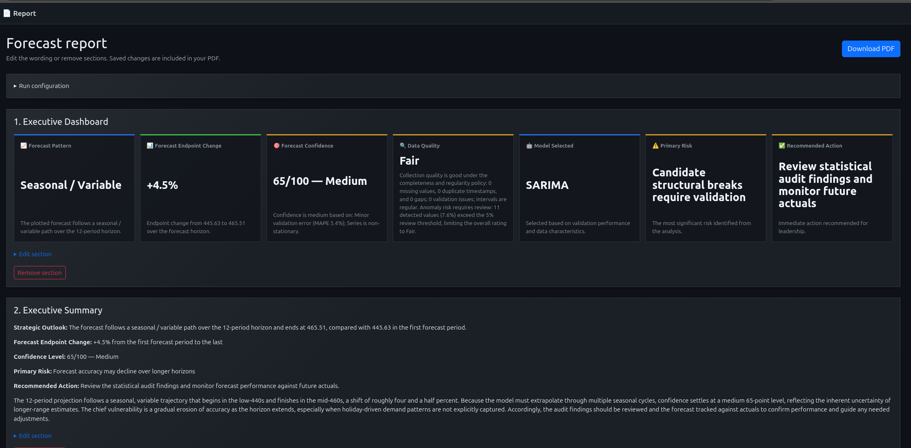
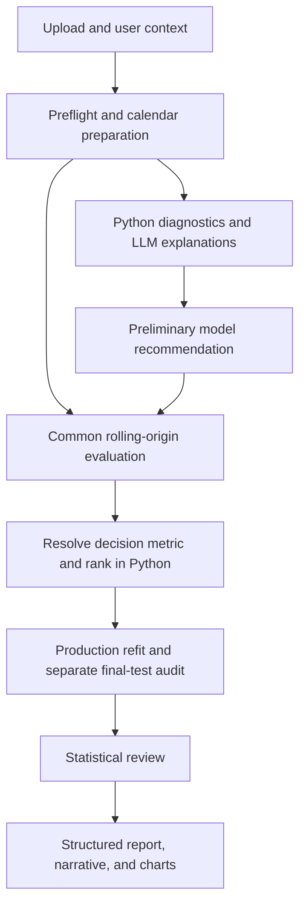
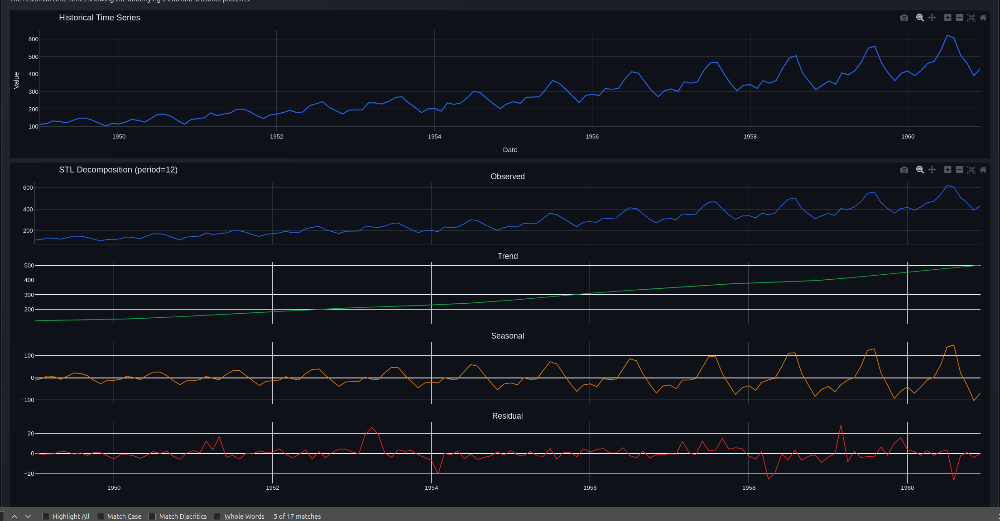
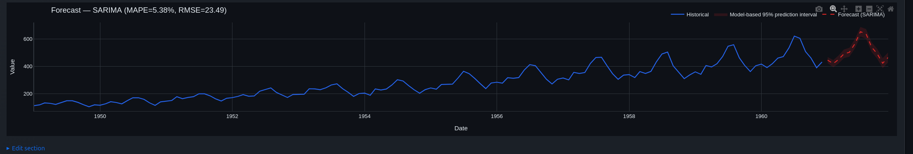

# Forecasting Agent: Architecture and Methodology

A useful forecast needs more than a line on a chart. You need to know which observations shaped it, how it performed on dates it hadn’t seen, and whether its uncertainty range deserves your trust. This document explains how the application answers those questions, including the parts that still depend on your data and deployment choices. It describes the repository as reviewed on September 6, 2026.

## 1. The business problem and what the agent delivers

Suppose an operations team needs to plan for the next six months using a spreadsheet of monthly demand. Some months appear twice; others are missing. A few peaks might reflect promotions, or they might be recording errors. The team needs a forecast, but first it needs to decide what those records mean. This example is hypothetical. The screenshots show a separate application run, not measured results for this team.

Start by uploading a CSV or Excel file and choosing the date column, numeric target, and forecast horizon. Each analysis handles one target series. You can specify units and aggregation rules, set target bounds, and supply holidays, events, or future predictor values.

The report combines the forecast with model comparisons and diagnostic charts so readers can inspect the evidence behind the result. You can read it in the app, export a PDF, or use its structured data and Markdown/HTML versions. The data-explorer chat handles follow-up questions. Once actual observations arrive, the monitoring API scores them against the saved forecast.

*Figure 1. The dashboard puts the forecast and its main caveats beside the executive summary. Results belong to the pictured run.*

The workflow has six named agent stages, coordinated by Python:

| Stage | Responsibility |
|---|---|
| Data validation | Audit the prepared time index, missing values, schema, and quality issues; explain the findings. |
| Statistical analysis | Calculate evidence about trend, seasonality, stationarity, anomalies, and other characteristics. |
| Preliminary model selection | Explain model suitability and propose an initial model from the diagnostic profile. |
| Forecasting | Evaluate candidate procedures, select using a deterministic policy, and fit the production forecast. |
| Statistical review | Check consistency, residual evidence, and policy concerns; add an explanatory critique. |
| Report generation | Build a structured report from computed evidence, then generate and validate narrative sections. |

## 2. Data cleaning: what is applied and when

Fix the calendar first. Then, within each training window, estimate any treatments that depend on target values. This order matters: a spike in the validation period mustn’t influence the clipping threshold used to prepare earlier training data.

### Dates, values, duplicates, and frequency

| Issue | Implementation | Practical effect |
|---|---|---|
| Invalid dates | Parse with `pandas.to_datetime(errors="coerce")`; discard rows without usable dates. | Undatable observations cannot enter the time series. An entirely unusable date column raises an error. |
| Nonnumeric targets | Convert with `pandas.to_numeric(errors="coerce")`. | Unparseable values become missing values for subsequent handling. |
| Unsorted observations | Sort by timestamp. | Training and validation follow chronological order. |
| Duplicate timestamps | Support mean, sum, keep-first, or latest. Default and “Let AI Decide” resolve to mean. | Repeated measurements can be averaged; transaction totals can be summed when explicitly selected. |
| Frequency | Use the chosen frequency or infer it from timestamps. | Establishes the calendar used for lags and future forecast dates. |
| Aggregation | Explicit sum, mean, first, or last resampling. Sum uses `min_count=1`. | Empty periods remain missing rather than becoming false zero demand. |
| Missing timestamps | Reindex onto a regular calendar. | Absent periods appear as missing targets. If records fall outside the selected grid, explicit aggregation is required. |

If two January rows represent separate sales transactions, sum them to preserve total demand. Taking their mean would answer a different question. You need to make that choice; the spreadsheet alone may not explain what each row represents.

### Missing observations

By default, the engine linearly interpolates gaps within each training window, then fills remaining edge gaps forward or backward. You can also choose forward-fill, which uses backward filling for leading gaps. Neither choice consults observations outside that training window.

Despite its name, the legacy `drop` option keeps the regular calendar during forecasting. It interpolates training gaps and excludes missing validation actuals from scoring. Deleting timestamps would change what a seasonal lag means.

Descriptive analysis uses a separately filled copy of the history; charts and reports retain the prepared history in its original units. The cleaning utility includes seasonal-decomposition imputation, although the forecasting engine doesn’t expose it as a standard choice. Unsupported engine imputation methods fall back to interpolation.

### Outliers and optional smoothing

Outlier treatment is optional. The default, including “Let AI Decide,” is no automatic outlier treatment.

| Choice | Calculation and application |
|---|---|
| IQR clipping / winsorizing | Calculate `IQR = Q3 − Q1` on the training window. Clip values to `[Q1 − 1.5 × IQR, Q3 + 1.5 × IQR]`. |
| Remove | Use the same training IQR bounds, replace flagged values with missing values, then apply training-window imputation. Timestamps remain present. |
| Z-score clipping | Calculate training mean and population standard deviation; clip to `mean ± 3 × standard deviation`. |
| EWMA smoothing | Optionally smooth training observations with exponentially decreasing weights; default span is 6. |
| Savitzky–Golay smoothing | Optionally fit local polynomial smoothing; defaults are window 11 and polynomial order 2, adjusted for short series. |

The engine treats outliers before imputing gaps and applying optional smoothing. It scores forecasts against untreated validation actuals. Be careful with clipping: a promotion peak can be exactly the pattern you want the model to learn.

### Transformations

The engine evaluates separate “Auto transform” candidates for eligible model families. Within a training window, absolute skewness above 1 triggers Box–Cox for strictly positive data or Yeo–Johnson when nonpositive values are present. Parameters are estimated from that window. Disabling the Box–Cox option removes these automatic transformation candidates.

To return predictions to their original units, the engine inverse-transforms simulated paths and takes their mean. Simply inverse-transforming a mean would generally give a different answer. Transformed candidates compete alongside other procedures, so the engine can keep the original scale when it works better.

## 3. Statistical methods

Python libraries calculate the diagnostics below. The LLM explains those results to the reader.

| Method | What it establishes in this application |
|---|---|
| ADF and KPSS | Complementary stationarity evidence. ADF tests a unit-root null; KPSS tests a stationarity null. Conflicting or unavailable evidence is reported rather than treated as certainty. |
| Detrended periodogram and STL | Identify candidate cycle lengths and assess seasonal strength after separating trend, seasonal structure, and residual variation. Calendar frequency supplies a prior; candidates are checked against the data. |
| ACF and PACF | Visualize dependence at different lags and support interpretation of autoregressive and seasonal structure. |
| OLS trend with Newey–West HAC inference | Estimate slope and R-squared, with standard errors robust to autocorrelation and heteroskedasticity. Trend classification combines significance and effect size. |
| Kendall trend and Theil–Sen slope | Add monotonic-trend evidence and a robust slope estimate with a confidence interval. |
| Adjusted-residual MAD anomaly detection | Remove trend/seasonal structure, then use a robust median absolute deviation rule to identify unusual residuals. This differs from raw-value IQR cleaning. |
| Calibrated binary segmentation | Flag candidate level changes using threshold calibration, minimum segment lengths, and spacing rules. Variance breaks are assessed separately. |
| Ljung–Box | Assess serial dependence in the series or model innovations, subject to sample-size and lag constraints. |
| ARCH effects | Check adjusted residuals for evidence of changing conditional variance. |
| Intermittency assessment | Describe the fraction of zero demand and spacing between positive occurrences for nonnegative targets. |
| Residual and interval diagnostics | Examine forecast bias, error variance by horizon, innovation behavior, interval coverage, average width, and Winkler interval score. |

STL seasonal strength is based on `max(0, 1 − Var(residual) / Var(seasonal + residual))`. Strong seasonal evidence can justify evaluating seasonal methods; it does not itself decide the winning model.

*Figure 2. Historical observations and STL decomposition expose the underlying trend, repeating seasonal pattern, and remaining residual variation. This example uses a seasonal period of 12.*

Short or constant series won’t support every diagnostic. The result records unavailable tests and their reasons; missing evidence doesn’t count as a negative finding. Treat a detected change point as a date to investigate. Check what changed in the business and whether the change lasted.

## 4. Supported forecast models and their implementation

Administrators can enable or disable the seven model families below. The common engine uses the same fitting procedure for backtests and the production forecast, including any transformations or recent-history windows.

| Model | Statistical approach | Implementation |
|---|---|---|
| ARIMA | Autoregressive lags, differencing, and moving-average errors. | `pmdarima.auto_arima` performs a bounded stepwise order search using AICc on training data. KPSS guides ordinary differencing. Nonconverged fits fail. |
| SARIMA | ARIMA with seasonal autoregression, differencing, and moving-average terms. | The same fitting machinery enables seasonal terms when the detected period and training length permit; OCSB guides seasonal differencing. |
| Holt–Winters | Exponential smoothing of level, optional trend, and optional seasonality. | `statsmodels.ExponentialSmoothing` compares no trend, additive trend, and damped additive trend with admissible seasonal forms. Multiplicative seasonality requires positive targets. Training AICc selects the form, with AIC fallback when AICc is unavailable. |
| EWMA | Simple exponential smoothing of the level. | `statsmodels.SimpleExpSmoothing` estimates initialization and optimizes the smoothing coefficient. Point forecasts extend the estimated level. |
| Prophet | Decomposable trend, seasonality, and optional holiday/regressor effects. | Fits Prophet to `ds`/`y` history; attaches supported declared holidays and date-aligned regressors. Predictive samples supply interval estimates. |
| Dynamic Regression | Calendar/Fourier predictors with ARIMA errors. | Builds time/calendar and known-ahead predictor matrices; searches Fourier complexity and ARIMA errors using training AICc. Future predictors must be available for the forecast dates. |
| Intermittent Demand (TSB) | Separately smooth demand occurrence probability and positive demand size. | Opt-in through intermittent-demand context, or a forced TSB request. Searches alpha and beta over `{0.05, 0.1, 0.2, 0.4}` using training one-step squared error. Requires nonnegative data, zeros, at least two positive occurrences, and at least 10 periods. |

TSB forecasts expected demand as occurrence probability times positive demand size. Its intervals add an experimental simulation assumption: independent Bernoulli occurrences and resampled positive sizes. They are not an analytical coverage guarantee from TSB itself.

The engine also evaluates four baselines: **Naive** repeats the last observation, **Seasonal Naive** repeats the latest seasonal cycle, **Mean Forecast** repeats the historical mean, and **Drift** extrapolates the average change between the first and last observations. Seasonal Naive requires two complete training cycles.

Additional candidates include eligible automatic transformations, recent-window variants, and a **Simple Ensemble** when at least two of Holt–Winters, ARIMA, and EWMA are enabled. Recent windows default to `max(24, 4 × calendar period)` observations. The ensemble equally averages member point forecasts and combines predictive samples into a mixture distribution.

Uncertainty is model-specific: ARIMA-family methods use fitted model uncertainty, smoothing methods simulate state evolution, Prophet supplies predictive samples, and baselines use simulated error paths. The default reported ranges are 95% prediction intervals. Observed coverage is evaluated separately; a nominal 95% label does not prove 95% real-world coverage. Optional target bounds constrain prediction paths, and explicit quantile forecasting uses path quantiles.

*Figure 3. The forecast chart places future predictions alongside the observed history and displays their prediction interval. The model name and error metrics describe the pictured run; interval coverage must be assessed separately.*

## 5. How the best model is chosen

The winner depends on the error you care about and the history available for validation. A method that wins on average absolute error may lose when large misses carry a greater penalty.

### Step 1: Use common chronological validation windows

Backtesting moves the training cutoff forward through history. At each cutoff, every candidate forecasts the same later dates, using only its training window to prepare targets and choose parameters. Predictor inputs must also have been available at that cutoff; the next section explains how the engine checks them.

The configuration defaults to a maximum of eight origins and requires at least two successful common origins for automatic ranking. The requested forecast horizon is retained when feasible; shorter history can reduce the evaluated horizon, which is recorded in the validation design.

When there’s enough history, the engine sets aside a final block equal to the requested horizon. It chooses the winner before scoring that block, which provides a separate audit. The production fit uses all available history.

### Step 2: Choose the decision metric

Let `e = actual − forecast` over observed validation targets.

| Metric | Meaning |
|---|---|
| MAE | Mean absolute error: `mean(abs(e))`, in original target units. |
| RMSE | Root mean squared error: `sqrt(mean(e²))`; puts greater weight on large errors. |
| WAPE | `100 × sum(abs(e)) / sum(abs(actual))`; expresses error relative to total absolute observed volume. |
| MASE | Absolute error scaled by a naive lag-based error calculated from training data. The calendar-based scaling lag is common across candidates. |
| MAPE | Mean absolute percentage error; unavailable if any scored actual is zero. |
| Pinball loss | Quantile loss: `max(q × e, (q − 1) × e)`; supports an explicitly chosen forecast quantile. |

The implementation also reports sMAPE and RMSSE when estimable. Unavailable metrics carry reasons rather than being encoded as zero error.

An explicit supported user loss takes precedence. In Auto mode, the forecasting LLM may recommend MASE, WAPE, RMSE, or MAE from business context and comparison evidence. If that recommendation is unavailable or cannot be parsed, MASE is the default. If the resolved metric is unavailable for every eligible candidate, selection falls back to MAE.

### Step 3: Apply the deterministic ranking policy

1. Exclude procedures with failed or incomplete common-fold evidence, and any explicitly excluded candidates.
2. Rank by the resolved loss, using other supported metrics as secondary ordering criteria.
3. Compare the top two candidates. For positive losses, a ratio below 1.05 is treated as practically negligible; prefer the simpler candidate according to the implemented name-based simplicity order.
4. Retain the best baseline if a selected complex model does not meet the improvement threshold: `baseline loss / complex-model loss < 1.10`. The complex model is kept only when the ratio is `>= 1.10`.
5. Fit the selected procedure for production. If it fails, exclude it and rerank the same validation evidence. If none remain eligible, report failure.

The ratio threshold is a policy choice, not a statistical significance test. Its exact formula corresponds to a complex-model error at most about 90.9% of baseline error. The report also records sensitivity winners under alternative supported losses, since changing the objective can change the preferred model.

A user can force a supported enabled model. This is recorded as a manual selection; it does not mean the model won automatic validation. A failed forced fit raises an error instead of silently becoming a different model.

### Step 4: Review the result

Python checks the result for consistency, and the review LLM adds its critique. An optional retry allows one further pass. Overriding the selected procedure requires a reason that the code recognizes; an LLM’s preference alone won’t replace the winner.

## 6. Predictor availability and interval calibration

A predictor’s observation date doesn’t tell you when someone could have used it. Suppose a January figure was first published in February and revised in March. A backtest ending in January mustn’t use either publication; a February cutoff can use only the first version.

For Dynamic Regression and Prophet, the engine resolves each supplied predictor to its latest version available at the training cutoff. API inputs accept `{value, available_at}` records, or a list of those records for revisions. The setup form accepts `date=value@available_at`. If a required value wasn’t available, that candidate fails the fold rather than using information from the future.

Fixed schedules can use scalar values with an explicit `covariates_known_in_advance: true` declaration. The fitted configuration records that this relies on the caller’s assertion. Without the declaration or dated records, a predictor-consuming candidate can’t proceed. Custom events become known on their supplied `available_at` date, or on the event date when no availability date exists. Country-calendar holidays remain known calendar inputs. These checks don’t reconstruct historical versions of the target itself; callers still need to supply appropriate target history.

The interval adjustment uses the selected procedure’s non-overlapping validation windows. At each horizon, it measures how far actuals fell outside the original interval and uses the empirical 95th percentile of those misses to widen future ranges. It needs at least five observed errors for that horizon. Missing actuals and unsupported horizons don’t contribute; declared target bounds still apply.

This is an empirical correction with limited samples. Selection and calibration share the same backtest evidence, so the correction carries no distribution-free 95% coverage guarantee. The separate final test compares the original and adjusted intervals without contributing calibration errors. Its audit reports coverage and width by horizon, usually with only one observation per horizon. Read the sample counts before drawing conclusions.

The forecast response records these details under `validation_design.interval_calibration`. If the history is too short, it retains the original range and reports insufficient evidence. Calibration changes interval endpoints, not point forecasts or the underlying simulated paths.

## 7. Following forecasts after they’re issued

The application saves each issued forecast as an immutable snapshot. Submit actuals through `POST /jobs/{job_id}/actuals`; `GET /jobs/{job_id}/monitoring` returns its errors, bias, interval coverage, and performance against the baselines saved at issue time. Correcting an actual updates its stored value without refitting the forecast.

Use `POST /monitoring/compare` with a JSON array of job IDs to compare repeated runs. Each job must pass ownership checks and refer to the same series and preparation semantics. Runs from the same upload can use the file ID; successive uploads need a shared `monitoring_series_id` in their preflight options. Keep that identifier specific to one target and unit of measurement.

The comparison reports errors by horizon and separates earlier results from recent ones. Duplicate first forecast timestamps count as one origin, retaining the latest issued snapshot. For alerts, it builds recent and earlier groups of complete runs with the same horizon length. Each group includes at least five runs and expands backward until it has 20 observed predictions and 20 distinct actual dates. Until then, the response says `insufficient_evidence`.

Review alerts identify persistent under- or overforecasting, declining baseline skill, and falling interval coverage. Bias requires the same direction in every run in the recent group. A baseline alert requires negative recent skill and a decline greater than 0.10; a coverage alert requires recent coverage below 90% and a drop of at least 10 percentage points, with at least 20 interval observations in each group. These are operational thresholds, not significance tests. Forecast errors can overlap across runs, and the system doesn’t retrain automatically when an alert appears.

## 8. What the LLM contributes

The LLM spends most of its work explaining computed results. It also has a narrower decision role: in Auto mode, its loss recommendation can affect which procedure wins. Statistical libraries produce the numerical forecasts and uncertainty estimates.

| Point in the workflow | What the LLM does | Boundary |
|---|---|---|
| Validation | Explains computed quality findings and preparation choices. | It does not execute free-form cleaning instructions. “Let AI Decide” cleaning currently resolves to fixed defaults. |
| Statistical analysis | Summarizes diagnostic evidence and suggests considerations or remediation. | Descriptive suggestions do not directly transform the forecasting history. |
| Initial model selection | Explains suitability and proposes a model from the statistical profile. | The ordinary final choice is replaced by the forecasting engine's empirical deterministic selection. |
| Forecasting | Explains comparison results and recommends a decision loss in Auto mode. | It does not generate the numerical forecast or directly rank the final winner. Its loss recommendation can indirectly affect the winner. |
| Statistical review | Critiques consistency and potential limitations. | Python controls eligibility for a selection override. |
| Report generation | Writes executive summaries, outlooks, risks, and recommendations from structured report sections and methodology context. | Narrative validators check selected unsupported claims and inconsistencies; one repair attempt precedes deterministic fallback text. |
| Data-explorer chat | Answers questions using dataset summaries and retrieved analysis memory; can propose chart configurations. | Chart configurations are restricted and sanitized before use. |

For explanations, retrieval-augmented generation (RAG) searches methodology documents and stored analysis summaries using local sentence-transformer embeddings and ChromaDB. Retrieval supplies context to a prompt; it doesn’t train the LLM on your upload.

The configured providers are Google Gemini, Ollama Cloud, and local or self-hosted Ollama. LLM calls generally use temperature zero, which reduces variability but does not guarantee identical text. Several stages provide fallback explanations when a call fails, and report fallback status is recorded. This does not guarantee that the entire application will run without valid LLM configuration: some stages instantiate the client outside their call-level fallback handling.

## 9. Data privacy: implemented controls and boundaries

Choose the LLM endpoint with your data boundary in mind. A controlled local endpoint can keep inference on your infrastructure. Cloud providers receive the content of the prompts you send them.

### Access and credentials

- The frontend provides authenticated sessions and role-based administration. Protected backend endpoints use API username/key authentication when enabled; backend API keys are verified against Argon2id hashes.
- Uploaded files and jobs have backend ownership checks. Ordinary authenticated API users are restricted by owner; administrators have broader audit access. Data-explorer analysis retrieval filters by file ID and backend owner ID.
- Backend ownership identifies the API principal. Multiple frontend users sharing one service credential are not separate backend tenants solely because of these checks; frontend authorization also matters.
- LLM provider secrets are encrypted with Fernet in backend storage. The frontend separately encrypts stored backend connection credentials. Generated backend encryption-key files use restrictive `0600` permissions.
- The supplied deployment terminates HTTPS at Nginx. Certificate verification and internal network protection remain deployment responsibilities; traffic from Nginx to application containers uses HTTP.

Authentication can be disabled for development. In that mode, authenticated ownership protections do not provide the same isolation.

### What the LLM can receive

Forecasting and reporting prompts contain computed statistics, diagnostic details, model metrics, structured report content, and user-supplied context. These can reveal commercially sensitive information even without uploading the entire source file to the provider.

Data-explorer chat summarizes up to 20 columns. When suitable columns exist, it also includes the highest five and lowest five records for a selected numeric column, with their dates. Those record values, your question, and retrieved analysis memory can reach the configured LLM endpoint.

Gemini and Ollama Cloud receive this prompt content remotely. Local Ollama can keep inference within a controlled environment when its configured endpoint is actually local or trusted. The provider name alone does not establish the network boundary. The repository does not enforce a cloud provider's retention or training policy, nor does it provide a general automatic PII-redaction or anonymization layer for prompts.

### Stored data, memory, and logs

Uploads become Parquet files, with metadata in SQLite. Jobs retain request details and options; ChromaDB can index completed analyses. Monitoring uses saved forecast snapshots. Each store has its own lifecycle.

The application encrypts credentials; it does not apply equivalent application-level encryption to dataset Parquet files, analysis memory, or all forecast records. Host/disk encryption, database and volume permissions, backups, and encryption-key protection determine their storage security.

ChromaDB is configured with anonymized telemetry disabled and uses local embeddings. Initial embedding-model acquisition may still require a download. This setting is not an application-wide promise of zero network traffic.

File-cache eviction and configurable terminal-job retention exist, but terminal-job cleanup is not an end-to-end erasure guarantee across files, RAG memory, forecast snapshots, exports, logs, and backups. Data-explorer questions are logged, and operational logs include identifiers and some error context. Sensitive information typed into a question can therefore also reach logs.

For a private deployment, the relevant operational choices are a controlled Ollama endpoint, enabled authentication, verified TLS where applicable, protected storage and backups, and an explicit retention process covering each store. These are deployment requirements, not claims that the current code automatically supplies complete data isolation or deletion.

## 10. Returning to the demand-planning example

Return to the hypothetical demand-planning team. It has resolved the duplicate months and kept genuine promotional peaks. Now it can compare forecasts on the same historical dates, inspect errors at the horizons it plans around, and check which assumptions the model used.

Seasonal Naive may win. Another procedure may improve the chosen loss enough to justify its complexity. The dataset and the evaluation decide; this example supplies no measured accuracy result.

After issuing forecasts, the team can submit actuals and compare successive runs. A measured case study would need those observed outcomes alongside the dataset description, run settings, and validation results.

## 11. Implementation reference

These source files provide the basis for this document:

| Area | Source |
|---|---|
| Pipeline and review retry | [pipeline_service.py](../data_forecaster/backend/services/pipeline_service.py) |
| Calendar preparation and cleaning | [preflight.py](../data_forecaster/backend/utils/preflight.py), [data_cleaning.py](../data_forecaster/backend/utils/data_cleaning.py) |
| Training-window preparation and candidates | [preprocessing.py](../data_forecaster/backend/forecasting/preprocessing.py), [engine.py](../data_forecaster/backend/forecasting/engine.py) |
| Diagnostic methods | [diagnostics.py](../data_forecaster/backend/forecasting/diagnostics.py), [residual_diagnostics.py](../data_forecaster/backend/forecasting/residual_diagnostics.py) |
| Model implementations | [registry.py](../data_forecaster/backend/forecasting/registry.py), [window_models.py](../data_forecaster/backend/forecasting/window_models.py), [holt_winters.py](../data_forecaster/backend/forecasting/holt_winters.py), [dynamic_regression.py](../data_forecaster/backend/forecasting/dynamic_regression.py), [intermittent.py](../data_forecaster/backend/forecasting/intermittent.py) |
| Evaluation and selection | [backtesting.py](../data_forecaster/backend/forecasting/backtesting.py), [metrics.py](../data_forecaster/backend/forecasting/metrics.py), [selection_policy.py](../data_forecaster/backend/forecasting/selection_policy.py), [forecasting_agent.py](../data_forecaster/backend/agents/forecasting_agent.py) |
| Predictor availability and calibration | [known_context.py](../data_forecaster/backend/forecasting/known_context.py), [calibration.py](../data_forecaster/backend/forecasting/calibration.py) |
| Forecast monitoring | [forecast_monitoring.py](../data_forecaster/backend/services/forecast_monitoring.py) |
| Narrative safeguards | [narrative.py](../data_forecaster/backend/report/narrative.py) |
| Provider and credential handling | [llm_factory.py](../data_forecaster/backend/core/llm_factory.py), [secret_store.py](../data_forecaster/backend/core/secret_store.py), [API authentication dependency](../data_forecaster/backend/auth/dependency.py) |
| Data storage and LLM data exposure | [file_service.py](../data_forecaster/backend/services/file_service.py), [job_service.py](../data_forecaster/backend/services/job_service.py), [chat_service.py](../data_forecaster/backend/services/chat_service.py), [knowledge_base.py](../data_forecaster/backend/rag/knowledge_base.py) |

[Back to README](../README.md)
